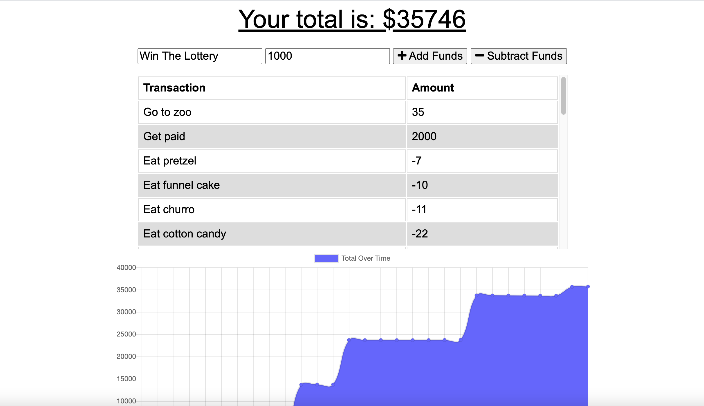
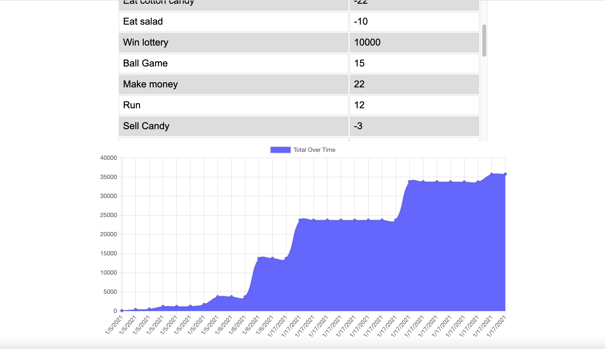

# Budget-Bilder

Let's build a budget that meets you and your family's needs. Budget Bilder.

## Project Details

Welcome to the Budget Bilder!

If you want to keep track of your daily, monthly, or yearly finances, Budget Bilder is the place for you. Track all of your purchases, expenses, deposits, and withdrawals with ease, simply add them into our application, and we will keep track of them for you. It can be a helpful way to keep track of your money, viewing past transactions with a interactive and visual chart, which documents your transactional history. This application can also be used offline, which makes for some good money mangement. Give Budget Bilder the time, and save more than a dime. 

Thanks for stopping in!

## Application

Budget Bilder: https://budget-bilder.herokuapp.com/

Welcome: 

## Build Details

This application was developed using: JavaScript, Progressive Web Applications, Service Worker, Node.js, Manifest, indexedDB, icons, API routes, Express, and more! 

## Repository & Preview

View the repository at: https://github.com/MichaelWitt/Budget-Bilder

Preview: 

## Updates

You can find project updates in the repository, highlighting what was done to create the final product.

https://github.com/MichaelWitt/Budget-Bilder/commits/

## Credits

UNC Coding Bootcamp And Trilogy for the inspiration.

Thanks!

## Thanks For Visiting!

Come back soon :)
